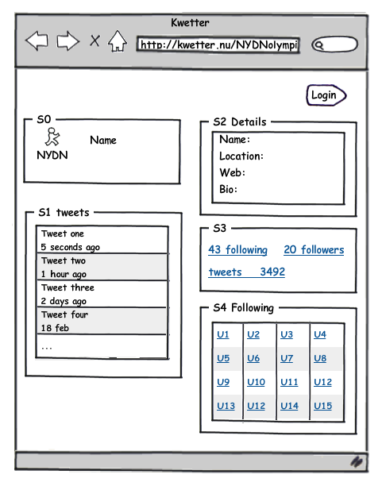
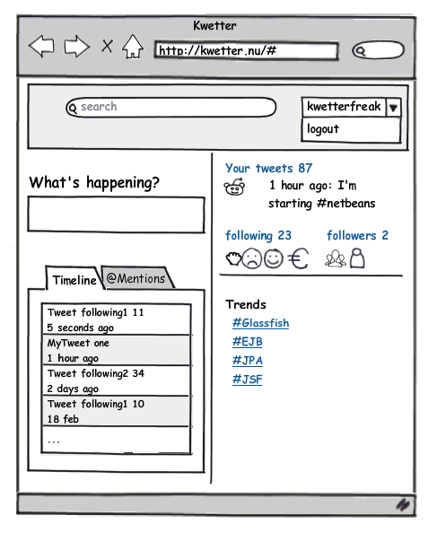

# kwetter

Kwetter is a Twitter.com clone. The goal of this project is to learn about enterprise architecture.

## Architecture

## Pages

**Profile Page:**  

| Function                      | Description                                                                                                         |
| ----------------------------- | ------------------------------------------------------------------------------------------------------------------- |
| Profile picture, profile name | Profile picture and name of the user.                                                                               |
| Profile details               | User details: bio, location, website. Bio is limited to 160 characters.                                             |
| Own tweets                    | 10 most recent tweets by this user.                                                                                 |
| Followers                     | Other users following this user. By clicking followers in S3, a list of followers appears in S1                     |
| Following                     | Other users followed by this user. After clicking one of the links in S4, information of that user wil appear in S4 |
| Heart                         | Users can add a heart symbol to the tweet of another user. A user can give at most one heart symbol to each tweet.  |

**Start Page:**  

| Function             | Description                                                                                                                                                              |
| -------------------- | ------------------------------------------------------------------------------------------------------------------------------------------------------------------------ |
| Search               | Search within all tweets. Results will be shown in the timeline tab.                                                                                                     |
| What's happening?    | Textbox to enter your tweet with a maximum of 140 characters. The tweet will be shown immediately under 'Your tweets'.                                                   |
| Timeline             | Timeline of tweets from the user and from other users being followed.                                                                                                    |
| @Mentions            | Tweets mentioning the user appear in this tab. It is possible to mention another user by adding @username in the tweet.                                                  |
| Following/ followers | After clicking on either the following or followers link, the profile page appears.                                                                                      |
| Trends               | Clicking on one of the trends results in list of tweets in the timeline tab. These tweets are at most one week old and contain a hashtag followed by the selected trend. |
| Logout               | After clicking logout the profile page appears. It is then possible to login as a different user.                                                                        |
| Login                | After clicking login and providing credentials, the starting page appears filled with tweets and other information for the user that is logged in.                       |

## Accounts

**Registration:**  
Create a registration form for new users.

**Moderation:**  
Create a page for users with the role of moderator. Moderators can see a list of users and their roles. They can remove users who spread insulting tweets or use swear words. In addition, moderators can change the role of other users to moderator.

**Administration:**  
An administrator can add or remove accounts of other users and may change the roles of other users.
