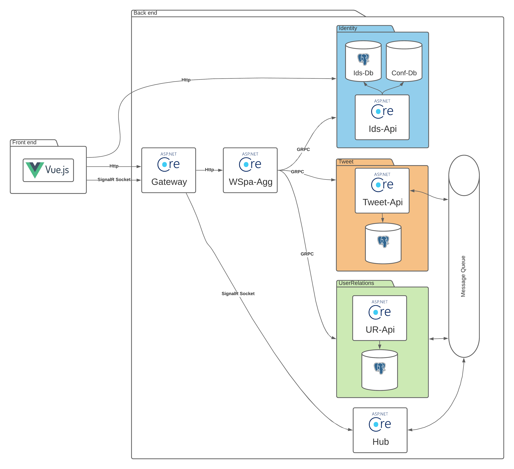
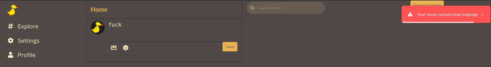

# kwetter

Kwetter is a Twitter.com clone. The goal of this project is to learn about enterprise architecture.  
[Original plan](./plan.md) is created by Fontys.

## 1 To Do List

- [x] Tweeting
- [x] Timeline
- [ ] Infinite scrolling
- [ ] Tweeting media
- [x] Login
- [x] Account registration
- [ ] Account privacy settings
- [ ] Blocking other users
- [x] Roles
- [ ] Administrator tools
- [ ] Moderator tools
- [x] Basic profiles
- [x] Authentication for services
- [x] Following
- [x] Searching for users
- [ ] Fancy profiles with profile picture and banner
- [ ] Dark/ light mode (this works but isn't persistent between refreshes)
- [x] Creating objects through a message queue
- [x] Events over an EventBut
- [x] Communication between services over GRPC
- [x] SignalR sockets
- [ ] Multiple SignalR hubs over 1 connection
- [ ] Redis caching
- [ ] [SignalR upscaling with Redis](https://docs.microsoft.com/en-us/aspnet/signalr/overview/performance/scaleout-with-redis)
- [x] Docker Compose configurations
- [ ] Kubernetes configuration
- [x] Distributed database configuration
- [x] Serverless function

There are ofcourse still many other things that can be improved or added.

## 2. Architecture

The project contains 3 domains.

| Domain        | Description                                                                                                               | Objects                        |
| ------------- | ------------------------------------------------------------------------------------------------------------------------- | ------------------------------ |
| Tweet domain  | Contains all tweet related information like tweet messages, tags and likes.                                               | Api, GrpcContracts, Events     |
| Identity      | This domain contains all the account and profile information. This domain also contains credentials for Kwetter services. | Identity Server, GrpcContracts |
| UserRelations | This domain contains relations that users have between each other. At the moment that is only followings.                 | Api, GrpcContracts, Events     |

### 2.1 Building blocks

To prevent us from repeating ourselves, the project contains a bunch of building blocks that can be used.

- EventBus
- Abstractions
- CQRS
- Identity
- KwetterDomain (Couple of useful classes)
- KwetterGrpc
- KwetterLogger
- KwetterSwagger

## 3 Demos

### 3.1 Distributed Databases

This project contains a Docker Compose for using a distributed database.
Using a distributed datbase is useful when hosting in multiple Kwetter instances that need to sync data.
For example, running Kwetter in a datacenter in Europe and in the USA and needing to have all the data available in both regions without a big performance impact.

In this example I have a instance running on my personal server, and an instance on my local machine.
The two instances are separated (SignalR hub doesn't update debug client) but the database are synced.

### 3.2 Websockets

When a tweet message is created by the user, the tweet Api first puts it on the message queue.
After it gets picked up from the queue and created, a event TweetCreated event is created.
The SignalR project sees this event and lets the creator and his followers know that a new tweet is added.

### 3.3 Serverless content filter function

This serverless function filters a tweet message on bad words.

